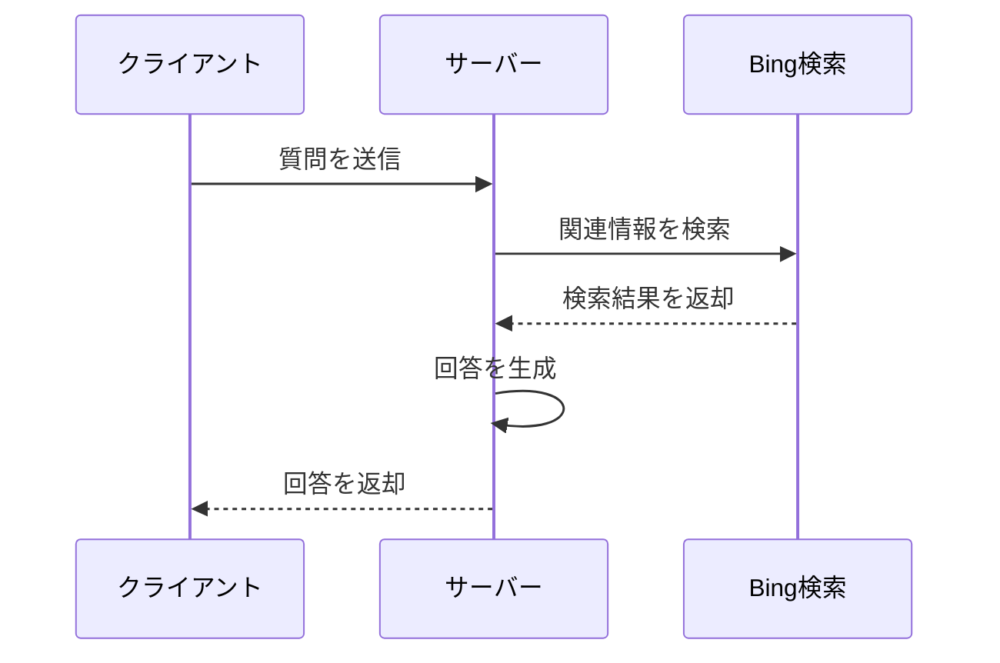

# サンプルアプリ

## できること



## 実行手順

### 1. 環境変数を設定

`server`ディレクトリに`.env`ファイルを作成し、`.env.sample`の内容をコピーし、それぞれの値をセット。

### 2. ローカル実行

サーバーを起動。

```
cd ./server/assistant_manager_sample
docker build -t agent:0.0.1 .
docker run -p 8000:8000 agent:0.0.1
```

クライアントを起動。

```
cd client 
npm run dev
```